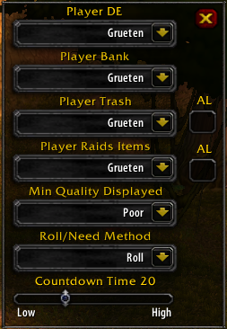
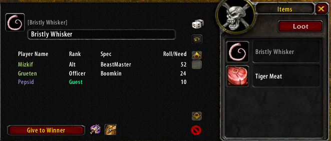
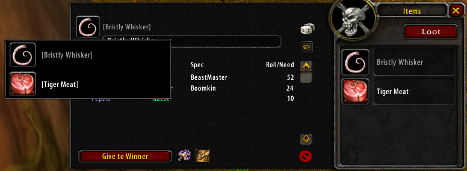

# MasterLoot

## Easy way to assign loot as ML

A new Addon imported from TBC & fully redesigned & optimized.

**This  Addon isnt compatible with AddOns changing UI of Default LootFrame like Skinning of Pfui, Xloot...**

*Command in game Available :*
> /xckmla Rand

This will make a Raid Random Player, like when you want give a Onyxia bag to random Guy

> /loot

This will open the options settings window. Recommend making a macro button for this so you don't have to wait to loot something in order to be able to configure addon. 

## Main Funcs of this Addon :

2 Methods available -> (+1 Need(MS) / +2 Greed(OS)) & ***Roll***

This addon has been configured to be used by a LC loot system using the ***Roll*** method. 

The lootprio.lua file has all the prios for each item and who can roll. When an item drops that matches an item on the list, the text box will auto populate the prio text. All the master looter has to do is click the dice button to announce the prio for the item in Raid Warning. 

If an item hasn't been decided on during an LC meeting, it could have "LC" prio assigned to it. If only "LC" is in the text window, and hit the dice button, it will send a message with a link of the item to the officers channel for input on what should be done with the item. 

**All is configurable** 

You can set a Disenchanter, a Banker, a guy for grey & White items, a guy for all Raids items like Idols, Coins, Elementium, Lavacore etc

You can set AutoLoot for Trash & Raids item guys by checking the AL box.

You can Change the quality of items displayed on Roll Window from Poor to Legendary.

- **Buttons on the LootFrame:**

1. **Triangle-skull Icon** on top right is to open the Settings for the Addon.
2. The **Beer Icon** is for announce all that dropped on Corpse.
3. The **"Loot" button** is to loot ALL ITEMS on corpse when you double click.

- **Buttons on Roll Window:**

1. **Dice** is for Announce & strat Rand/Need on this Item. You can change the announcement it the text box. 
2. **Circle Arrow** is for Countdown. Time can be set in the settings menu. You can click this button during a countdown to cancel the countdown.
3. **No Symbol** is to clear the need/random list.
4. **Broken sword** is for give loot to the Disenchanter Player Set.
5. **Bag** is for give loot to the Banker Player Set.

- **List Rolls window**

1. **Player Name** you can select the winning Player & click "Give to Winner" to give the item to them. Players are collored coded by their class color. 
2. **Rank** is using the guild rank of the player. ***Guest*** is someone who is not in the guild. 
3. **Spec** is using values from the officer note page (found by clicking on the user in the guild tab) and comparing it to the spectable.lua file. ***You need to be at least an officer to use this feature***
    - ***Rank*** and ***Spec*** are their to help with determining SR>MS>OS rolls
4. **Roll/Need** Is the roll of each player or if they selected need/greed.
5. **Switch item** If you want to switch an item to roll on, you just need to click on the item icon on the top right of the Roll Window:

